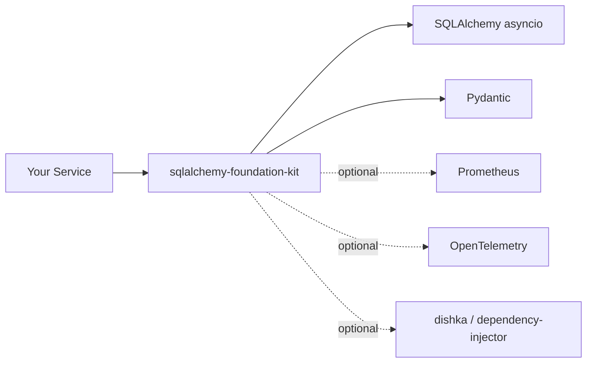

# sqlalchemy-foundation-kit

**Production-ready foundation for SQLAlchemy-based async services with Unit of Work, session management, and observability**

`sqlalchemy-foundation-kit` is a standalone, batteries-included foundation for building async SQLAlchemy microservices. It bundles everything you commonly re-implement for every service into a single library:

- **PostgreSQL configuration** — Pydantic-based settings with grouped connection / pool / query options
- **Session management** — `AsyncSessionManager` with pgbouncer transaction-mode compatibility
- **Unit of Work pattern** — `AsyncSQLAlchemyUnitOfWork` with automatic commit/rollback
- **Base ORM models** — Pre-configured `Base`, mixins, custom types (`PydanticJSONB`, `UnConstrainedEnum`)
- **Observability** — Prometheus connection-pool metrics and OpenTelemetry tracing
- **DI integration** — Ready-to-use providers for [`dishka`](https://github.com/reagento/dishka) and `dependency-injector`

Only `sqlalchemy[asyncio]` and `pydantic` are required by default — everything else is an opt-in extra.

## Key Features

✅ **Single dependency** — All foundation pieces in one place  
✅ **Unit of Work pattern** — Transactional consistency with automatic commit/rollback  
✅ **Connection pool management** — `AsyncSessionManager` with metrics and health checks  
✅ **pgbouncer compatible** — Custom connection class for transaction mode  
✅ **Observability built-in** — Prometheus metrics + OpenTelemetry tracing  
✅ **Type-safe configuration** — Pydantic settings with validation  
✅ **Base ORM models** — Pre-configured `Base` with naming conventions and mixins  

## Installation

```bash
# Basic installation (core functionality)
pip install sqlalchemy-foundation-kit

# With pydantic-settings support
pip install sqlalchemy-foundation-kit[settings]

# With Prometheus metrics
pip install sqlalchemy-foundation-kit[metrics]

# With OpenTelemetry tracing
pip install sqlalchemy-foundation-kit[telemetry]

# With dishka dependency injection
pip install sqlalchemy-foundation-kit[dishka]

# With dependency-injector containers
pip install sqlalchemy-foundation-kit[dependency-injector]

# With orjson serialization
pip install sqlalchemy-foundation-kit[orjson]

# All features
pip install sqlalchemy-foundation-kit[all]
```

## Quick Start

### 1. Configuration (with pydantic-settings)

```python
from pydantic import SecretStr
from pydantic_settings import BaseSettings
from sqlalchemy_foundation_kit.contrib.settings import (
    BasePostgresConfig,
    ConnectionSettings,
    PoolSettings,
    QuerySettings,
)

class Settings(BaseSettings):
    postgres: BasePostgresConfig = BasePostgresConfig(
        connection=ConnectionSettings(
            host="localhost",
            port=5432,
            user="postgres",
            password=SecretStr("secret"),
            database="mydb",
        ),
        pool=PoolSettings(),  # Uses defaults
        query=QuerySettings(),  # Uses defaults
        application_name="my-service",
    )
```

Or implement `PostgresSettingsProtocol` directly:

```python
from dataclasses import dataclass
from sqlalchemy_foundation_kit import (
    PostgresSettingsProtocol,
    ConnectionSettingsProtocol,
    PoolSettingsProtocol,
    QuerySettingsProtocol,
)

@dataclass
class MyConnectionSettings:
    host: str = "localhost"
    port: int = 5432
    user: str = "postgres"
    database: str = "mydb"

@dataclass
class MyPoolSettings:
    kind: str = "async_adapted_queue"
    size: int | None = 10
    max_overflow: int | None = 20
    pre_ping: bool = True
    recycle: int | None = 3600
    timeout: float | None = 30.0

@dataclass
class MyQuerySettings:
    echo: bool = False
    statement_cache_size: int | None = 0
    prepared_statement_cache_size: int | None = 0
    isolation_level: str | None = None

class PostgresConfig:
    connection: ConnectionSettingsProtocol = MyConnectionSettings()
    pool: PoolSettingsProtocol = MyPoolSettings()
    query: QuerySettingsProtocol = MyQuerySettings()
    application_name: str = "my-service"
    db_schema: str | None = None
    use_orjson_serialization: bool = True
    jit: str | None = "off"
    
    def to_dsn(self) -> str:
        return f"postgresql+asyncpg://{self.connection.user}@{self.connection.host}:{self.connection.port}/{self.connection.database}"
```

### 2. Define ORM Models

```python
from sqlalchemy.orm import Mapped, mapped_column
from sqlalchemy_foundation_kit import BaseTable, DatetimeColumnsMixin

class UserDB(BaseTable, DatetimeColumnsMixin):
    __tablename__ = "users"
    __created_at_index__ = True  # Index on created_at

    id: Mapped[UUID] = mapped_column(primary_key=True)
    email: Mapped[str] = mapped_column(unique=True)
    username: Mapped[str]
```

### 3. Create Session Manager

```python
from sqlalchemy_foundation_kit import create_async_session_manager

async def main():
    session_manager = create_async_session_manager(
        settings.postgres,
        metrics=postgres_metrics,  # optional
    )
    
    async with session_manager.get_transaction() as session:
        user = UserDB(id=uuid4(), email="user@example.com", username="user")
        session.add(user)
        # Auto-commit on exit
```

### 4. Unit of Work Pattern

```python
from unit_of_work_kit import AsyncSQLAlchemyUnitOfWork, AsyncSQLAlchemyUowTransaction

# Define your transaction with repositories
class MyTransaction(AsyncSQLAlchemyUowTransaction):
    @property
    def users(self) -> UserRepository:
        if self._users is None:
            self._users = PostgresUserRepository(self.session)
        return self._users

# Create UoW
class MyUnitOfWork(AsyncSQLAlchemyUnitOfWork[MyTransaction]):
    def __init__(self, session_maker):
        super().__init__(session_maker, transaction_factory=MyTransaction)

# Usage in use case
class CreateUserUseCase:
    def __init__(self, uow: MyUnitOfWork):
        self._uow = uow
    
    async def execute(self, email: str) -> User:
        async with self._uow.transaction() as tx:
            user = await tx.users.create(email=email)
            await tx.outbox.create(UserCreatedEvent(...))
        return user
```

## What's Included

### Core (always available)
- **Session Management**: `AsyncSessionManager`, `AsyncCConnection`
- **Base ORM**: `Base`, `BaseTable`, `DatetimeColumnsMixin`, `UnConstrainedEnum`, `PydanticJSONB`
- **Unit of Work**: `AsyncUnitOfWork`, `AsyncSQLAlchemyUnitOfWork`, `IsolationLevel`
- **Protocols**: `PostgresSettingsProtocol`, `PostgresMetricsProtocol`
- **Utilities**: `build_engine_kwargs`, `resolve_pool_class`, `load_orm_metadata`

### Contrib (optional dependencies)

#### `contrib.settings` (requires `[settings]`)
```python
from sqlalchemy_foundation_kit.contrib.settings import (
    BasePostgresConfig,
    BasePostgresMigrationsConfig,
)
```
- `BasePostgresConfig` — Pydantic-based PostgreSQL configuration
- `BasePostgresMigrationsConfig` — Migrations configuration

#### `contrib.metrics` (requires `[metrics]`)
```python
from sqlalchemy_foundation_kit.contrib.metrics import PostgresMetrics
```
- `PostgresMetrics` — Prometheus metrics for connection pool
- Tracks: pool size, checked out connections, checkout duration, errors

#### `contrib.di` (requires `[dishka]`)
```python
from sqlalchemy_foundation_kit.contrib.di import (
    AsyncDatabaseProvider,
    AsyncUnitOfWorkProvider,
    PrometheusPostgresMetricsProvider,
)
```
- `AsyncDatabaseProvider` — Provides `AsyncSessionManager` and `async_sessionmaker`
- `AsyncUnitOfWorkProvider` — Provides `AsyncUnitOfWork`
- `PrometheusPostgresMetricsProvider` — Provides Prometheus metrics integration

**Example with Dishka:**
```python
from dishka import make_async_container
from sqlalchemy_foundation_kit.contrib.di import (
    AsyncDatabaseProvider,
    AsyncUnitOfWorkProvider,
    PrometheusPostgresMetricsProvider,
)

container = make_async_container(
    AsyncDatabaseProvider(),
    AsyncUnitOfWorkProvider(),
    PrometheusPostgresMetricsProvider(),
    # ... your providers
)
```

#### `contrib.dependency_injector` (requires `[dependency-injector]`)
```python
from sqlalchemy_foundation_kit.contrib.dependency_injector import (
    DatabaseContainer,
    AsyncDatabaseResourceProvider,
    PrometheusMetricsContainer,
)
```
- `DatabaseContainer` — Container providing `session_manager`, `session_maker`, and `uow`
- `AsyncDatabaseResourceProvider` — Manual lifecycle management helper
- `PrometheusMetricsContainer` — Container for Prometheus metrics integration

**Example with dependency-injector:**
```python
from dependency_injector import containers, providers
from sqlalchemy_foundation_kit.contrib.dependency_injector import (
    DatabaseContainer,
    PrometheusMetricsContainer,
)

class AppContainer(containers.DeclarativeContainer):
    config = providers.Singleton(Settings)
    
    metrics = providers.Container(
        PrometheusMetricsContainer,
        metrics_settings=config.provided.metrics,
        default_prefix=providers.Object("myapp"),
        postgres_settings=config.provided.postgres,
    )
    
    database = providers.Container(
        DatabaseContainer,
        postgres_config=config.provided.postgres,
        metrics=metrics.postgres_metrics,
    )

container = AppContainer()
await container.init_resources()

# Use dependencies
uow = container.database.uow()
async with uow.transaction() as tx:
    user = await tx.users.create(...)
```

#### `contrib.telemetry` (requires `[telemetry]`)
```python
from sqlalchemy_foundation_kit.contrib.telemetry import (
    instrument_sqlalchemy,
    instrument_asyncpg,
    TracedAsyncUnitOfWork,
)
```
- `instrument_sqlalchemy()` — OpenTelemetry instrumentation for SQLAlchemy
- `instrument_asyncpg()` — OpenTelemetry instrumentation for asyncpg
- `TracedAsyncUnitOfWork` — UoW with automatic span creation

**Example with OpenTelemetry:**
```python
from opentelemetry import trace
from opentelemetry.sdk.trace import TracerProvider
from opentelemetry.sdk.trace.export import ConsoleSpanExporter, BatchSpanProcessor

# Setup tracer
provider = TracerProvider()
processor = BatchSpanProcessor(ConsoleSpanExporter())
provider.add_span_processor(processor)
trace.set_tracer_provider(provider)

# Instrument SQLAlchemy
from sqlalchemy_foundation_kit.contrib.telemetry import (
    instrument_sqlalchemy,
    TracedAsyncUnitOfWork,
)

instrument_sqlalchemy(engine=engine)

# Use traced UoW
uow = TracedAsyncUnitOfWork(
    session_maker=session_maker,
    transaction_factory=MyTransaction,
    service_name="my-service",
)

async with uow.transaction() as tx:
    # Automatically creates span "uow.transaction"
    user = await tx.users.create(...)
```

## Architecture



## Documentation

Full documentation is available at [https://bedrock-python.github.io/sqlalchemy-foundation-kit/](https://bedrock-python.github.io/sqlalchemy-foundation-kit/)

## License

This project is licensed under the Apache License 2.0 - see the [LICENSE](LICENSE) file for details.
