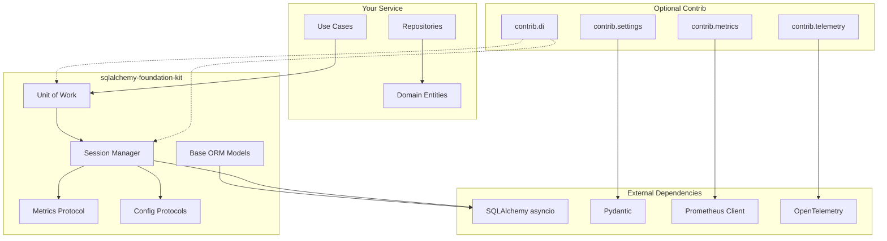

# SQLAlchemy Foundation Kit

**Production-ready foundation for SQLAlchemy-based async services with Unit of Work, session management, and observability**

`sqlalchemy-foundation-kit` is a standalone, batteries-included foundation library that eliminates repetitive boilerplate when building async SQLAlchemy microservices. Instead of re-implementing the same patterns for every service, you get a single library with everything you need:

- **PostgreSQL configuration** — Pydantic-based settings with grouped connection / pool / query options
- **Session management** — `AsyncSessionManager` with pgbouncer transaction-mode compatibility
- **Unit of Work pattern** — `AsyncSQLAlchemyUnitOfWork` with automatic commit/rollback
- **Base ORM models** — Pre-configured `Base`, mixins, custom types (`PydanticJSONB`, `UnConstrainedEnum`)
- **Observability** — Prometheus connection-pool metrics and OpenTelemetry tracing
- **DI integration** — Ready-to-use providers for [`dishka`](https://github.com/reagento/dishka) and `dependency-injector`

Only `sqlalchemy[asyncio]` and `pydantic` are required by default — everything else is an opt-in extra.

## Key Features

✅ **Single dependency** — All foundation pieces in one place  
✅ **Unit of Work pattern** — Transactional consistency with automatic commit/rollback  
✅ **Connection pool management** — `AsyncSessionManager` with metrics and health checks  
✅ **pgbouncer compatible** — Custom connection class for transaction mode  
✅ **Observability built-in** — Prometheus metrics + OpenTelemetry tracing  
✅ **Type-safe configuration** — Pydantic settings with validation  
✅ **Base ORM models** — Pre-configured `Base` with naming conventions and mixins  
✅ **Zero-downtime deploys** — Graceful engine disposal with timeout

## Why Use This Library?

### Problem: Repetitive Boilerplate

Every SQLAlchemy-based service typically needs:

1. **Configuration management** — DSN construction, pool settings, query options
2. **Session lifecycle** — Context managers, commit/rollback logic, cleanup
3. **Transaction management** — Unit of Work pattern with nested transactions
4. **Observability** — Metrics for pool size, checkout duration, query errors
5. **Base models** — Naming conventions, timestamp mixins, custom types
6. **DI wiring** — Providers for session makers, UoW, repositories

Without a foundation library, you end up:

- Copy-pasting the same code across services
- Maintaining duplicate implementations
- Risking subtle bugs in transaction handling
- Missing observability in some services

### Solution: Foundation Kit

`sqlalchemy-foundation-kit` consolidates all these concerns into a single, well-tested library:

```python
# Before: 300+ lines of boilerplate per service
# After: ~20 lines of config + imports

from sqlalchemy_foundation_kit import (
    create_async_session_manager,
    AsyncSQLAlchemyUnitOfWork,
    BaseTable,
    DatetimeColumnsMixin,
)
from sqlalchemy_foundation_kit.contrib.settings import BasePostgresConfig
from sqlalchemy_foundation_kit.contrib.di import AsyncDatabaseProvider

# Config
settings = Settings(postgres=BasePostgresConfig(...))

# Session manager (with metrics, health checks, graceful shutdown)
session_manager = create_async_session_manager(settings.postgres, metrics=metrics)

# Unit of Work (with nested transactions, rollback, advisory locks)
uow = MyUnitOfWork(session_manager.session_maker)

# ORM models (with naming conventions, timestamps, custom types)
class UserDB(BaseTable, DatetimeColumnsMixin):
    __tablename__ = "users"
    ...
```

## Installation

```bash
# Basic installation (core functionality)
pip install sqlalchemy-foundation-kit

# With pydantic-settings support
pip install sqlalchemy-foundation-kit[settings]

# With Prometheus metrics
pip install sqlalchemy-foundation-kit[metrics]

# With OpenTelemetry tracing
pip install sqlalchemy-foundation-kit[telemetry]

# With dishka dependency injection
pip install sqlalchemy-foundation-kit[dishka]

# With dependency-injector containers
pip install sqlalchemy-foundation-kit[dependency-injector]

# With orjson serialization
pip install sqlalchemy-foundation-kit[orjson]

# All features
pip install sqlalchemy-foundation-kit[all]
```

**Requirements:** Python 3.11+

## Quick Example

```python
from uuid import UUID, uuid4
from pydantic import SecretStr
from pydantic_settings import BaseSettings
from sqlalchemy.orm import Mapped, mapped_column
from sqlalchemy_foundation_kit import (
    create_async_session_manager,
    BaseTable,
    DatetimeColumnsMixin,
)
from sqlalchemy_foundation_kit.contrib.settings import BasePostgresConfig

# 1. Configuration
class Settings(BaseSettings):
    postgres: BasePostgresConfig = BasePostgresConfig(
        connection={"host": "localhost", "port": 5432, "database": "mydb"},
    )

settings = Settings()

# 2. ORM Model
class UserDB(BaseTable, DatetimeColumnsMixin):
    __tablename__ = "users"
    __created_at_index__ = True

    id: Mapped[UUID] = mapped_column(primary_key=True, default=uuid4)
    email: Mapped[str] = mapped_column(unique=True)
    username: Mapped[str]

# 3. Session Manager
async def main():
    session_manager = create_async_session_manager(settings.postgres)
    
    # Use transactional context
    async with session_manager.get_transaction() as session:
        user = UserDB(email="user@example.com", username="john")
        session.add(user)
        # Auto-commit on exit, auto-rollback on exception
    
    # Graceful shutdown
    await session_manager.close()
```

## Architecture



## What's Included

### Core (always available)

- **Session Management**: `AsyncSessionManager`, `AsyncCConnection`, `RetryConfig`
- **Unit of Work**: `AsyncUnitOfWork`, `AsyncSQLAlchemyUnitOfWork`, `IsolationLevel`
- **Base ORM**: `Base`, `BaseTable`, `DatetimeColumnsMixin`, `UnConstrainedEnum`, `PydanticJSONB`
- **Protocols**: `PostgresSettingsProtocol`, `PostgresMetricsProtocol`, `AsyncUowTransaction`
- **Utilities**: `build_engine_kwargs`, `resolve_pool_class`, `load_orm_metadata`

### Contrib (optional dependencies)

#### `contrib.settings` (requires `[settings]`)

Pydantic-based configuration models:

- `BasePostgresConfig` — Complete PostgreSQL configuration
- `ConnectionSettings` — Host, port, user, password, database
- `PoolSettings` — Pool size, overflow, timeout, pre_ping
- `QuerySettings` — Echo, cache sizes, isolation level

#### `contrib.metrics` (requires `[metrics]`)

Prometheus metrics for connection pool:

- `PostgresMetrics` — Pool size, checked out connections, checkout duration, errors
- Tracks health checks, pool exhaustion, timeouts

#### `contrib.di` (requires `[dishka]`)

Dishka providers for dependency injection:

- `AsyncDatabaseProvider` — Provides `AsyncSessionManager` and `async_sessionmaker`
- `AsyncUnitOfWorkProvider` — Provides `AsyncUnitOfWork`
- `PrometheusPostgresMetricsProvider` — Provides Prometheus metrics

#### `contrib.dependency_injector` (requires `[dependency-injector]`)

`dependency-injector` containers:

- `DatabaseContainer` — Session manager, session maker, UoW
- `PrometheusMetricsContainer` — Prometheus metrics
- `AsyncDatabaseResourceProvider` — Manual lifecycle management

#### `contrib.telemetry` (requires `[telemetry]`)

OpenTelemetry instrumentation:

- `instrument_sqlalchemy()` — Auto-instrument SQLAlchemy queries
- `instrument_asyncpg()` — Auto-instrument asyncpg connections
- `TracedAsyncUnitOfWork` — UoW with automatic span creation

## Next Steps

- **[Quick Start](guide/quickstart.md)** — Get started in 5 minutes
- **[Configuration](guide/configuration.md)** — Learn about all configuration options
- **[Advanced Usage](guide/advanced.md)** — Unit of Work, metrics, telemetry, DI
- **[API Reference](reference/index.md)** — Complete API documentation

## License

This project is licensed under the Apache License 2.0 - see the [LICENSE](https://github.com/bedrock-python/sqlalchemy-foundation-kit/blob/master/LICENSE) file for details.
